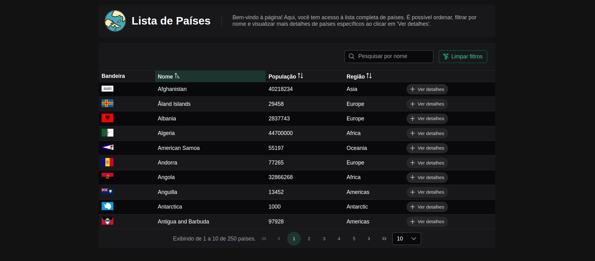
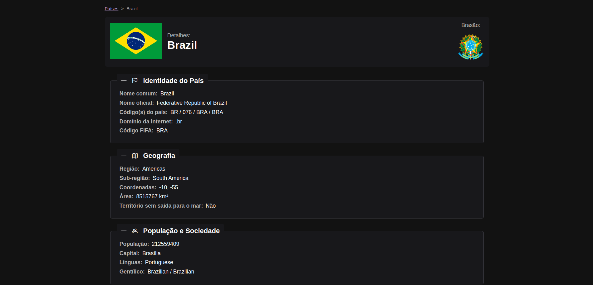
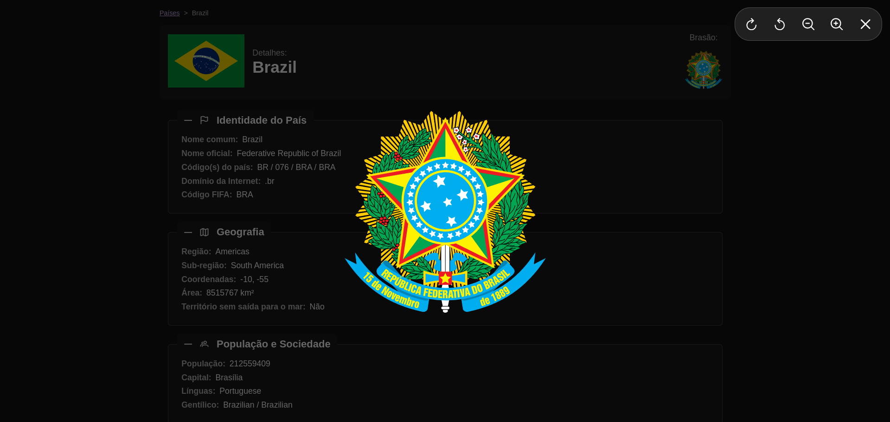
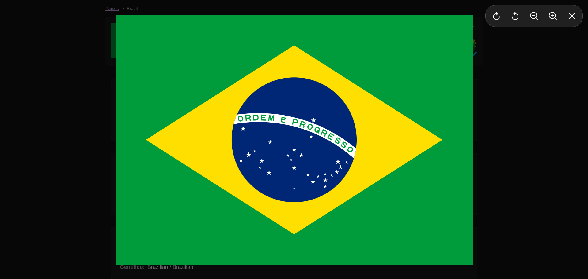

# Angular Nations - Lista de Países

Angular Nations é um projeto em Angular 19 que permite explorar um conjunto de dados sobre países do mundo. O projeto apresenta informações detalhadas sobre cada país, incluindo nome, população, região, bandeira, e muito mais. Ele oferece funcionalidades como ordenação, filtragem e navegação para visualização de detalhes dos países.

## Instalação

1. Clone este repositório:

```bash
git clone https://github.com/seu-usuario/angular-nations.git
```
2. Navegue até o diretório do projeto:

```bash
cd angular-nations
```
3. Instale as dependências:

```bash
npm install
```
4. Inicie o servidor de desenvolvimento:

```bash
ng serve
```
5. Abra o navegador e acesse o projeto em`http://localhost:4200/`:


### Tela inicial

Aqui está uma captura de tela da tela inicial, onde os usuários podem ver a lista de países e usar o filtro de pesquisa:



### Detalhes do país

Ao clicar em um país, os usuários podem ver detalhes como população, região, idioma, e muito mais:





### Licença

Este projeto é licenciado sob a MIT License.


